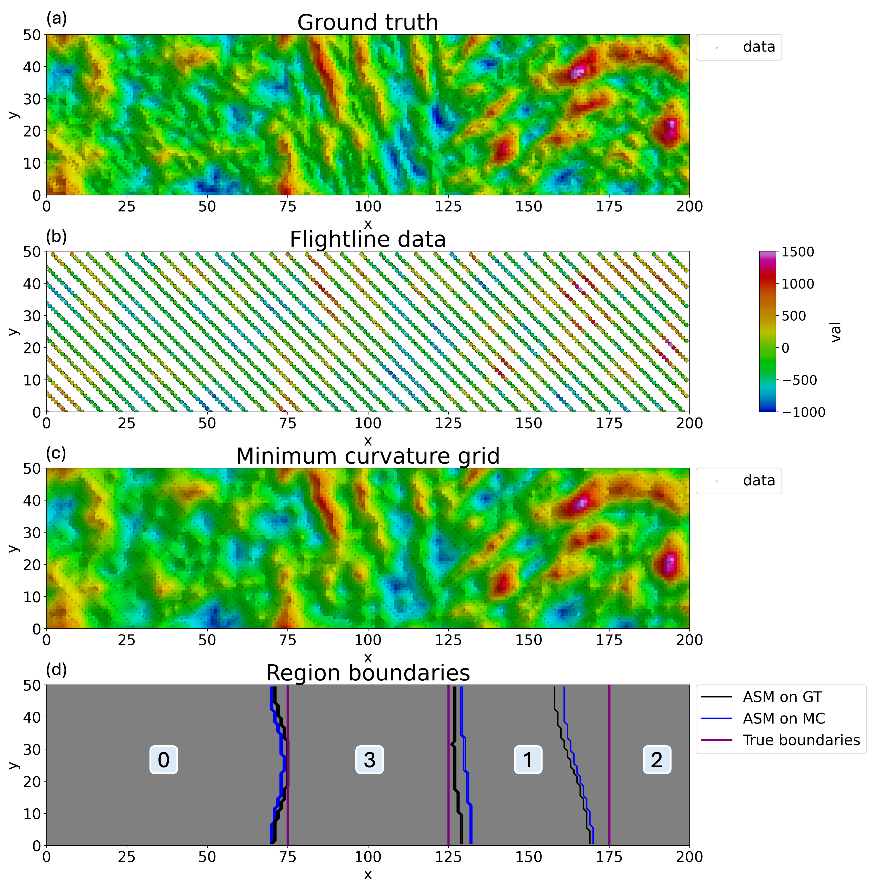

# Multigrid Simulation: multigrid-sgsim
This repository houses the multigrid simulation method, a Python package for stochastic interpolation of airborne geophysical data. This is the software supporting the manuscript "**Interpolation of large-scale airborne geophysical data with uncertainty quantifcation**", which has been submitted to the journal [Computers \& Geosciences](https://www.sciencedirect.com/journal/computers-and-geosciences) for review.

The method presented here combines [automatic segmentation](#automatic-segmentation-method) with [multigrid simulation](#multigrid-simulation).

## Automatic Segmentation Method
Demonstration of the automatic segmentation method (ASM; [Honarkhah and Caers, 2012](https://link.springer.com/article/10.1007/s11004-012-9413-6)) on a synthetic dataset.  


## Multigrid Simulation
Demonstration of MGSIM iterations generating one realization.


## Getting Started
### Installation
Create and activate a clean environment:
```bash
python -m venv venv_mgsim
source venv_mgsim/bin/activate   # (Windows: venv_mgsim\Scripts\activate)
```
Upgrade pip and install the multigrid_sgsim package:
```bash
python -m pip install -U pip
pip install git+https://github.com/Stanford-Mineral-X/multigrid-sgsim.git
```

### Run demo notebooks
Clone the repository:
```bash
git clone https://github.com/Stanford-Mineral-X/multigrid-sgsim.git
```
Navigate to the multigrid-sgsim repository you just cloned:
```bash
cd multigrid-sgsim
```
Launch demo notebook (pip install jupyter if not already installed):
```bash
jupyter notebook ./examples/demo_mgsim.ipynb # or ./examples/demo_asm.ipynb
```
Run either notebook (./examples/demo_asm.ipynb or ./examples/demo_mgsim.ipynb) for a demonstration of generating interpolated grids with the multigrid simulation (MGSIM) methodology.


## Repo Tree
```
.
├── examples
│   ├── data
│   │   ├── fl_xyvc.csv
│   │   └── gt_xyvc.csv
│   ├── demo_asm.ipynb
│   └── demo_mgsim.ipynb
├── figures
│   ├── asm_synthdata.png
│   └── mgsim_iterations.png
├── pyproject.toml
├── README.md
├── src
│   └── multigrid_sgsim
│       ├── __init__.py
│       ├── asm.py
│       ├── mgsim.py
│       ├── sampling.py
│       ├── segmenting.py
│       ├── trendmaking.py
│       └── utils.py
└── tests
    └── test_imports.py
```

## License
This code is released for non-commercial and research purposes. For commercial use, please contact the authors.
